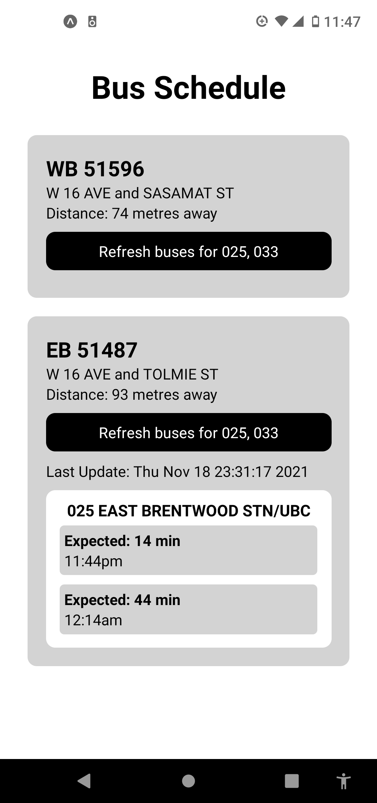
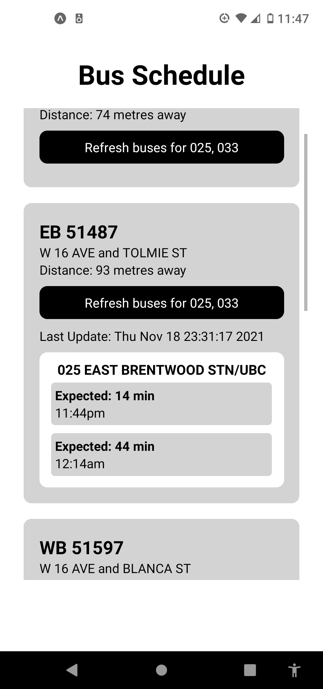

# Translink Next Bus Stop Application

Base Sample|Scroll Sample   
--- | ---
 | 

### Project Background
In Vancouver, you have the following options when looking at the arrival of buses

1. Text the bus stop number located at each stop
    Benefit: for a cheapskate like me, I don't need to use any of my data to get stop information
    Disadvantage: Hard to check bus arrival times in advance without being at the stop, unless I want to memorize all the stop numbers of the buses I usually take. 
2. Use Google Maps
    Benefit: detailed information about all bus options available to me
    Disadvantage: I often know my destination and the only way to get bus data from Google Maps is to type in my desired start and end destination. This is a time consuming process and uses up significant data (I have to ration 1GB of data each month)
3. Transit App
    Benefit: can usually "Favorite" the routes and stops that I frequent
    Disadvantage: I personally hate opening apps that take longer than 5 seconds to start up. I also need to manually note down all my most used stops, or else I need to search for my desired route each time

What I noticed was that there were no options that:
1. quick to open and check bus arrival times.
2. gave me a list of all buses around my current location.
3. didn't use a lot of data to search for bus times.

### Project Overview
I decided to try my hand out at creating a React Native Android App that I could just pull out of my pocket whenever I needed to bus. 

### Tech Stack
Translink API: the mobile app queries the open-access Translink API for bus data. Two types of queries are used:
1. Phone's current location (latitude & longitude) is passed into the Translink Bus Stops endpoint to return all the bus stops around a given radius (default 500 metres).
2. Using endpoint for a given bus stop, receive data about all bus routes and their next three buses. 

React Native: Given the small nature of the app and the fact there only needed to be one screen, I decided to implement the app using React Native. There's a platform called Expo that allows for the rapid development and testing of react native apps. I was able to develop and build a MVP pretty quickly. 

### Prerequisites to Running the App from this Repo
1. Go to Translink's API site and register for an api key
2. Create a ".env" file in the root folder of the application and include your api key and API URL
```
API_KEY=//insert API KEY here
URL=https://api.translink.ca/rttiapi/v1/stops
```
3. [Install expo](https://expo.dev)

If you are interested in using the app, please visit this link: [exp://exp.host/@watshever/busProject](https://exp.host/@watshever/busProject)


### Feature Backlog
- [ ] Slider for custom bus stop query radius
- [ ] Improve UI and branding of app
- [ ] Add in map to show location of bus stops
